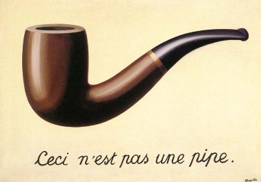

# HDR Steganography

This repo demonstrates the ability to hide two images into a single HDR JPEG file using the "Ultra HDR Image Format".

Two images of the same size can be merged into one file. Users with SDR will only see one image and users with HDR will see the other.

# Examples



If you are on an unsupported system or using an SDR display you will see the classic [The_Treachery_of_Images](https://en.wikipedia.org/wiki/The_Treachery_of_Images) painting. If your system support HDR then you will see something like the below:


You need to be on a display with HDR and using software that supports HDR. I'm using Chrome on a modern MBP. It also works in Chrome on my phone.

Note that the above example does have ghosting. I'm fairly sure you can avoid that if you are more clever.

# Using it

Before using this you have to download and build [libultrahdr](https://github.com/google/libultrahdr/). Then note down the path to the `ultrahdr_app` binary. Then clone this repo.

The easiest way to run it yourself is to do:

```
$ export ULTRAHDR_BIN=...
$ uvx --with pillow --with numpy ipython
(3.12.3) projects/hdr-steganography  > uvx --with pillow --with numpy ipython
Python 3.12.3 (main, Apr 14 2024, 23:08:16) [Clang 15.0.0 (clang-1500.3.9.4)]
Type 'copyright', 'credits' or 'license' for more information
IPython 8.31.0 -- An enhanced Interactive Python. Type '?' for help.

In [1]: %run merge.py input1.jpeg input2.jpeg output.jpeg

```

# Security implications

Users could unknowingly share images that contain content that they don't approve of or agree with. As best I can tell only Instagram and Threads support HDR and I do not know if they re-encode in a way that defeats this. For example, you could imagine someone sharing this below image and only some subset of the population would see the "hidden" message.


I'm fairly confident no common AI is HDR-aware so you could use this to show humans one piece of content and AIs another. Potentially couuld be used by phishers to defeat anti-phishing scanners. Poisoning of AI image generation datasets is also possible?

# Limitations

Application of this technique is mainly limited by

- Aggressive re-encoding of images by image hosters
- Lack of HDR image support. Ultra HDR JPEGs have support on Chrome and Android (maybe iOS?). Firefox doesn't support this on any platform.
- Lack of HDR display support. Lots of people still have SDR displays.
